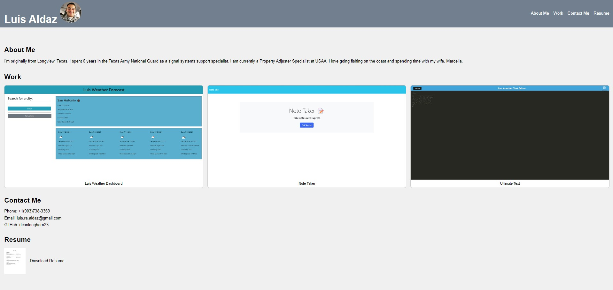

# Luis's Professional Profile Website (Module 02 Advanced CSS: Portfolio)

## This Challenge contains Luis's Professional Profile Website to include the following links:

- Work
  - Website link to my portfolio of created website that include: Luis Waether Dashboard, Note Taker, and Ultimate Text Editor websites
- Contact Me
  - I have provided my contact phone number, email, and clickable GitHub link
- Resume
  - There is a clickable image in which the viewer is able to view my resume

## Testing/Editing

- Open a new Git Bash terminal
- Go to 'Luis-Professional-Website' directory
- Once in 'Luis-Professional-Website' type in Git Bash terminal 'code .' and press enter(VS Code should pull up)
- Once VS Code pulls up, put the cursor on the 'index.html' file and right click file
- When the drop-down shows, click on "Open with Live Server".
- A window should open in your web browser with a preview of the website.
- At this point, you can make edits to the website and see those changes live in the browser.

## Usage

- When a viewer visits my professional website the viewer is able to view information about me, obtain my contact information, and review my resume.

## Website URL and GitHub Repository Links

- To access Luis's Professional Profile website: https://ricanlonghorn23.github.io/Luis-Professional-Website/
- To access Luis's Professional Profile repository: https://github.com/ricanlonghorn23/Luis-Professional-Website.git

## Screenshot of website

## Credits
- Luis Aldaz
